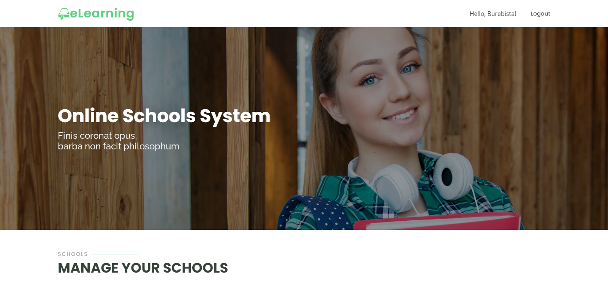
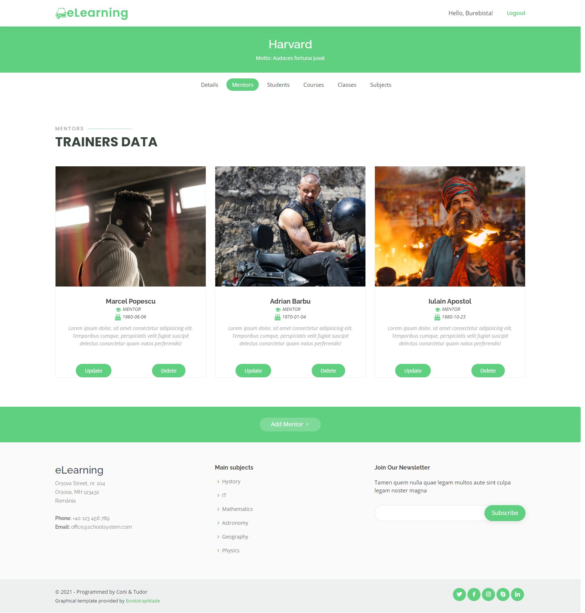

# E-learning App Front-end Project

This is part of the E-leaning Application from 3rd Team Work week practice of Codecool's .NET C# Module.

For the Back-end project of the app, go to [The Sound of Waves](https://github.com/TudorDan/TheSoundOfWaves).

## Description

An application for the classical school education system. A school inspectarate that can have an online evidence of main data (students, grades, teachers, courses) from the group of affiliated schools.

## Technologies used

React, Axios, Formik, Sweet Alert, Bootstrap

This project was bootstrapped with [Create React App](https://github.com/facebook/create-react-app).

The web design was implemented from a [BootstrapMade](https://bootstrapmade.com/free-website-templates/) free website template.

## Installation

After downloadin the repo, in order to install project dependecies, you can run:

```javascript
npm update
```

### `npm start`

Runs the app in the development mode.\
Open [http://localhost:3000](http://localhost:3000) to view it in the browser.

The page will reload if you make edits.\
You will also see any lint errors in the console.

## Implementation

Home page:


Teachers page:

